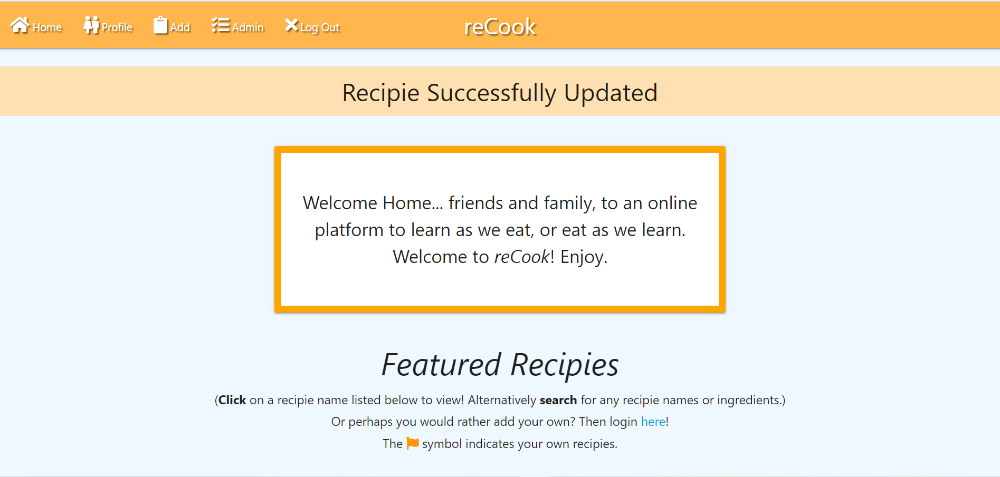

# MS3 - Online Cookbook Recipe Platform
This site is intended for people to not only **FIND** recipes, but also **SHARE** their own.
Thus, this site will aim to provide users with all they need to achieve their ideal meal. 

---

# UX

In terms of User Stories, this site behaves differently depending if the user is registered with the site, or is an anonymus visiter.
And so, as such, the user stories differ.

### **Anonymus User**

* *I want to find/search for recipes*
* *Who are the recipies made by?*
* *What do I gain from creating an account?*

### **Registered User** 
(shares many of the user stories with anonymys users, in addition to these...)

* *I want to share my own recipies with others*
* *I want to edit my own recipies*

However, there are also other cases that need to be noted.

* *The admin user will need to be able alter anything regarding the site, including user's recipies and general categories*

### **Wireframes**
* Included below are links to the wireframes for three major devices; **desktop**, **mobile**, and **tablets**)
(Alternatively, they may be found inside the "wireframes" folder directory).
https://github.com/Windmost8/MS3-Cookbook-MostaphaE/blob/45a75240e8e35247849fdf00fe29db085581a779/wireframes

* Screenshots relevant to the wireframes can also be found in the link below, or alternatively in the screenshots directory under the relevant device folder.
https://github.com/Windmost8/MS3-Cookbook-MostaphaE/blob/45a75240e8e35247849fdf00fe29db085581a779/screenshots

It is to be noted that the wireframes differ depending on user. Most notably is the inclusion of
an admin page, as well as the navbar showing an "admin" link. 

Additionally, the navbar will change depending on if a user is logged or not. Logged in users will be shown
a logout link as well a profile and add link. 

Furthermore, the add recipe and edit recipe pages share the same appereance, as do the sign and and register
pages, with the exception of different images and slighlty different text.

---

# Features

The **CRUD** guidelines are intended to be major features for this site's functionality and purpose.
Therefore major features include the abiltiy to add, update, locate, display, and delete recipies. 

Feature list;

* ***User Authentication***
    * The abiltiy to create an account and login, as well as utilize user authenticated features such as the CRUD functionality.
    * Login page can redirect you to register page (through text link) and vice versa.

* ***Adding***
    * The abiltiy to add a recipie/category (if admin), including everything relevant to it, such as a recipie name, category, ingredients, preparation, and any optional cooking tools.
    * Category names are shown through a drop down menu.

* ***Editing***
    * The ability to edit a recipie/category (if admin), including everything relevant to it, such as a recipie name, category, ingredients, preparation, and any optional cooking tools. 

* ***Searching***
    * The abiltiy to search for any recipie names or ingredients, and have them listed for the user. If no recipie matches the searches, no recipie is shown.
    * There is also a reset button to reset your searches and be redirected to the default state.

* ***Recipie List***
    * The abiltiy to view any current existing recipies, with clear distinctions between them, and the abiltiy to expand on them.
    User created recipies, from the perspective of the user have an orange flag distinguishing them as your own, from other recipes.
    * Clicking on a recipie expands the UI, and showcases its information.
    * Your own recipies will include an edit and delete button in the expanded recipie.

* ***Deleting***
    * The abiltiy to remove any recipies/categories (if admin), if wished.
    * Warnings before any deletion occurs with confirmations. (Modal)

* ***Social Media***
    * The footer displays social media links for further information on the site. (just for show in this project)

* ***Navigation Menu***
    * The navbar displays relevant and user friendly links for easy navigation, including the abiltiy to register and login, as well as add, browse,
     or view your own profile, in addition to be able to manage categories as an admin.
     * Mobile navigation is a side navigation bar accessed through the "burger" icon.

* ***Error page***
    * An error page created for the purpose of redirecting inaccesbile pages and features to users.

* ***Flash***
    * Flash messages appear whenever a major action has happened, such as logging in or failing to log in. Registering an account, or failing to register an account.
    Adding and editing recipies/categories successfully.

* ***Top/bottom buttons***
    * In place of pagination, there exists two buttons, one at the top of the recipie list and one at the bottom. 
    The top one which scrolls you down to the very bottom, and the bottom button doing vice versa.

**Future Features**
* Additional profile functionality such as user icons and additonal information or more...
* A rating system for recipies so that higher rated recipies may get more attention or showcased for a better while.

---

# Typography/Color Sceheme
Materlize was used as a css library for this project.
The color scheme decided upon was light orange, with an aliceblue background. The light orange in question is
called "orange lighten-2" from Materlize. The reason for orange was because I felt that it closely matched the theme
of the site, which was about cooking, and orange is a color very dominantly present in dishes.

The reason for an aliceblue background was just as a contrast against the orange color.

In addition, a text-shadow css class wa put in place to allow texts to be shown easier for the eyes against colorful backgrounds, which in this case was orange again.
Also, the text itself is white in color for it to also stand out despite the orange background.

Buttons found on the site can either be green or red, often indicating its nature. Red meaning something will be removed or deleted, and green indicating whatever else otherwise.
In addition, the recipies themselves are shown with a brown header, once again to contrast the orange and distinguish itself, whilst still being somewhat similiar to the orange theme.

Also, a max number of 2000 characters was chosen for certain form elements. I believe it was wiser to limit the number of characters in the end, however it is certainly possible to allow for user-choice.

---

# Technologies/Programs Used
* HTML 
* CSS 
* Materlize Library
* Python
* Flask
* MongoDB, AWS (Free Tier) (for its database use)
* Chrome Dev Tools 
* Lighthouse Audits
* Github
* Gitpod
* Pylint (for python code checks)
* Heroku (for deployment)
* Jinja
* dnspython
* Flask-pymongo
* Fontawesome (for its many available relevant icons)
* Jquery
* Werkzeug (for its password help)
* Balsamiq (for its wireframe help)

Additional technologies/installs may be observed in the requirements.txt file located in the directory, or accessed through here; https://github.com/Windmost8/MS3-Cookbook-MostaphaE/blob/39c2cf5fe35dca38f12ab4fad3b0c562eef14493/requirements.txt

* pip3 install flask
* pip3 install flask-pymongo
* pip3 install dnspython

* import os
* from flask import (
    Flask, flash, render_template,
    redirect, request, session, url_for)
* from flask_pymongo import PyMongo
* from bson.objectid import ObjectId
* from werkzeug.security import generate_password_hash, check_password_hash
* if os.path.exists("env.py"): 
* import env

Also to be noted is the pep8 compliance that is required.

As mentioned, Mongodb was used as the database for this projects functionality. 
In it we have created one cluster with one collection, which itself contains three records with several documents. 
A record for users, a record for recipies, and a final record for categories of recipie cooking bases, such as Beef or chicken.
Each document contains an objectid by which we can target and use for our project.

---

# Testing

* ***User Authentication***
---
    * **Expected** - Logging in **without** a registerd account should not work. Flash message should appear.
    * **Testing** - Tried to login without an account.
    * **Result** - The page refreshes indicating a failure to login. Flash message appears "Incorrent username/ and or password". Form required validators appear as well.

    * **Expected** - Logging in **with** a registerd account should work. Successful flash message should sppear, and redirection to profile page.
    * **Testing** - Tried to login with an account.
    * **Result** - Redirection to profile page, successful flash message appears; "Login Successful!"

    * **Expected** - Registering a new account **without** following text guidelines visible on page, should not work. Form validation should appear.
    * **Testing** - Tried to **register** without an account and/or without following guidelines.
    * **Result** - Form required validators appear as well.

    * **Expected** - Registering a new account successfully should log you in and redirect you to the profile page. Successful flash message should appear.
    * **Testing** - Creating a new account, following the guidelines mentioned on the register page.
    * **Result** - The page redirects correctly. Flash message appears "Registration Successful!".

    * **Expected** - After logging in/registering account, back button should not log you out or direct you to login/register page, but instead to Home.
    * **Testing** - After successful login/register, tried to backspace.
    * **Result** - The page redirects correctly. Still logged in.
---
    * **Expected** - Clicking the logout button should log you out successfully with flash message appearing. Back button shoud not work as well.
    * **Testing** - Logging out and then clicking the press button.
    * **Result** - The page redirects correctly. Flash message appears "You have been logged out". Back button redirects to intended error page.

    * **Expected** - Text link "here" from text at home page should correctly redirect user to login page. If logged in, then to home page.
    * **Testing** - Clicking on the "here" link.
    * **Result** -  For logged in user, home page is refreshed. For anonymus user, they are redirected correctly.

* ***Adding***
---
    * **Expected** - Add link from navbar at home page should correctly redirect user to add page. 
    If accessed by logged out/anon user, (through url for example), then user should be redirected to error page.
    * **Testing** - Clicking on the add navbar link. 
    * **Result** -  For logged in user, add page is shown. For anon user, error page is shown. 

---
    * **Expected** - Add form validation required.
    * **Testing** - Clicking on the "Confirm" button without filling in the form, testing each field, with the exception of the "Special Tools" which is optional. 
    * **Result** -  Form validation is present correctly.

---
    * **Expected** - Add recipie creation. Successfully filling out form correctly, and clicking the confirm button should flash succssfull message, and showcase recipie at recipie list on home page.
    * **Testing** - Clicking on the "Confirm" with correct form. Then viewing home page. 
    * **Result** -  Flash message displayed correctly, and recipie in question correctly viewable at home page.

---
    * **Expected** - Add category creation. Reserved for admin. Successfully filling out form correctly, and clicking the confirm button should flash succssfull message, and showcase category on category dropdown/admin page.
    * **Testing** - Checking whether the category drop down menu features the newly added category, and also on the admin page. Add category button on admin page.
    * **Result** -  Category correctly showcased both in dropdown and admin page. Correct flash message appears. 

* ***Editing***
---
    * **Expected** - Your own recipies displayed at home page with correct distingusiher (orange flag).
    * **Testing** - Create recipie, and view home page.
    * **Result** - Orange flag appears correctly next to recipie name.
---
    * **Expected** - Clicking on your own recipies should allow you to edit, and clicking on other user's recipies cannot. Accessing wrong user recipie edit url should redirect to error page. Successful edit should display flash message. 
    * **Testing** - Create recipie, view on home page, expand, and click on edit button. Click on confirm button.
    * **Result** - Should correctly redirect user to edit page for that recipie, prefilled. Confirming displas flash message.

---
    * **Expected** - Editing category (admin functionality) should allow you to pick any present category and edit its name. Successfully editing should display flash message.
    * **Testing** - Edit button on category should take you to edit category page with prefilled form. 
    * **Result** - Should correctly display edited category on relevant places, ie; admin categories page and categories dropdown. Successful flash message should be displayed.

---
    * **Expected** - Admin user may edit all recipies present.
    * **Testing** - Home page recipie list should all have orange flag and edit buttons.
    * **Result** - Editing correctly should update the recipie.

* ***Searching***
---
    * **Expected** - Search form should display "No results found" if no correct recipie was found. Empty seach form should display correct form validation.
    * **Testing** - Type in anything not present in list. Type in 1 character.
    * **Result** - Correct message alongside no recipies listed. Form validation for number of characters.

---
    * **Expected** - Search form should list only correct recipies from any ingredients or recipie names.
    * **Testing** - Type in anything present in list.
    * **Result** - Correct listed recipies.

* ***Deleting***
---
    * **Expected** - Deleting your own recipie should remove it from recipie list, but also show a modal warning.
    * **Testing** - Create a recipie, then click delete button. Agree to delete.
    * **Result** -  Recipie is removed from recipie list.

---
    * **Expected** - Deleting category (admin) should remove it from category dropdown and admin page, but also show a modal warning.
    * **Testing** - Create a category, then click delete button. Agree to delete. Look at category dropwdown and admin page.
    * **Result** -  Category removed from all relevant places.

* ***Social Media***
---
    * **Expected** - All social media links, link in a new tab.
    * **Testing** - Click on footer links.
    * **Result** - Seperate tab for each link.

* ***Navigation Menu***
---
    * **Expected** - Logged in users see "Home, Profile, Add, Log Out". Admin users see the same but with "Admin" as well. Anon users see "Home, Sign In, Register".
    * **Testing** - Log in as user, as admin, or browse as anon. Accessing these pages through URL as inaccesbile user results in error page.
    * **Result** - The navbar changes accordingly. 

* ***Devices Tested***

    * Moto G4
    * Galaxy S5
    * Pixel 2
    * Pixel 2 XL
    * iPhone 5/SE
    * iPhone 6/7/8
    * iPhone 6/7/8 Plus
    * iPhone X
    * iPad
    * iPad Pro
    * Surface Duo
    * Galaxy Fold

* ***Browsers Tested***
    * Google Chrome
    * Firefox
    * Microsoft Edge

### **Screenshots**

* All screenshots can be found in the screenshots folder,
or viewed from this link;
https://github.com/Windmost8/MS3-Cookbook-MostaphaE/blob/45a75240e8e35247849fdf00fe29db085581a779/screenshots

### **Validation**

* HTML code was validated through https://validator.w3.org/

* Javascript code was validated through https://jshint.com/

* CSS code was validated through https://jigsaw.w3.org/css-validator/

* Python code was validated through Pylint run through the terminal. In this case
"Pylint app.py" (without the quotes). However there are certain exceptions for the code present in this project.
No satisfactory solution was found for these errors.
    * app.py:113:12: R1705: Unnecessary "else" after "return" (no-else-return)
app.py:138:4: R1705: Unnecessary "else" after "return" (no-else-return)
app.py:258:8: R1705: Unnecessary "else" after "return" (no-else-return)
app.py:279:8: R1705: Unnecessary "else" after "return" (no-else-return)
app.py:308:4: R1705: Unnecessary "else" after "return" (no-else-return)
app.py:339:4: R1705: Unnecessary "else" after "return" (no-else-return)
app.py:24:4: W0611: Unused import env (unused-import)

    * Pylint also scores "Your code has been rated at 9.53/10 ..."

### **Issues** 

* At times, whilst opening browser through gitpod, the project shown may not be updated despite clicking on the refresh button. 
    Therefore one must ctrl-click the refresh button for a forced refresh. 

* Certain pylint errors remain (shown above)

* All template files show warnings which are unavoidable.

* Both py files show errors that are unavoidable.

---

# Deployment

### **Gitpod** 

* To preview site through gitpod, run the command "python3 -m http.server" in the terminal (without the quotes). 
* Executing this should prompt a pop up for port 8080
    alongside the options to "Make Public" or "Open Browser". If it is the first time after opening gitpod, then click on "Make Public", and then "Open Browser" if the pop up
    comes up again. If the pop up does not come, you may alternatively ctrl-click on the link that will be shown in the terminal for port 8080.
* Gitpod has no automatic saving, so saving after each change is optimal.

### **Github**
* In order to commit, whilst still in gitpod, running the command git add . (or a specific file/folder instead of "." (without the quotes)),
    will add all the changes you have done to be prepared for a commit. 
* After this step, you may run the command git commit -m "your comment" (your comment being whatever message you want to convey alongside the commit). Running this will 
    show how much changes were done, through the terminal.
* Finally, running the command git push should put your changes and project into your repository.

### **Heroku**
* Deployment on Heroku was done through their official website https://www.heroku.com/. 
* One must intially create an app name on Heroku, and 
then we connect that app to our github project respository. 
* For this project, automatic deployment was used from the Heroku site.
* Once you have connceted your git repo with heroku, you should then access the settings and "reveal config vars". Here we can securely tell heroku
which variables are required for deployment, such as (in our case); IP, PORT, SECRET_KEY, 
MONGO_URI, MONGO_DBNAME (and their relevant values). 
* Once that is done, we may then enable automatic deployment, and then finally, with the correctly selected branch,
you cann "deploy branch". Now the deployed site should be available and automically updated via our git commits.
* Additionally, the requirements.txt file must be constantly updated if any new installs were used, so that heroku knows.

### env.py 
* Included in the gitignore, is an env.py file, which includes sensitive information vital to the projects existance. 
* This includes a SECRET_KEY and database name and password. 
* These must be changed in order to make your own project.

---

# Credits 
The cooking images were taken from https://www.dreamstime.com/photos-images/asian-cooking.html. As such, watermarks are present.
The images in question are;
https://thumbs.dreamstime.com/b/onion-pepper-tomato-tomato-lime-vegetable-asian-cooking-vintage-image-onion-pepper-tomato-tomato-lime-vegetable-asian-185990624.jpg
https://thumbs.dreamstime.com/b/asian-food-cooking-wok-noodles-chicken-stir-fry-vegetables-ingredients-spices-sauces-chopsticks-dark-rustic-83701227.jpg

The other cooking image was a free stock photo, as well as the error image.
https://media.istockphoto.com/photos/cooking-mushrooms-picture-id964432374?k=6&m=964432374&s=612x612&w=0&h=5u7P8Z5DPGVyfHdiYufdEi_o83Lw4CK-FJKUKMyPc-E=
https://iconsplace.com/wp-content/uploads/_icons/ffa500/256/png/error-icon-11-256.png

User authentication and certain CRUD functionality were aided from Code Institute.

---
